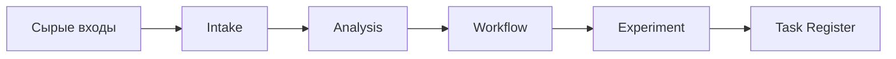
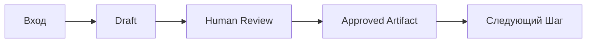
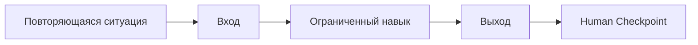
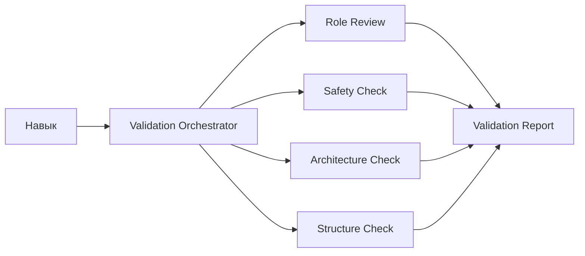

# Опорный План Пан-Лекции И Практикума

## Назначение
Этот документ нужен как передаваемый каркас для другого агента или ведущего:
- структура занятия по блокам;
- что показывать на слайдах;
- что говорить;
- где запускать практику;
- какие задавать контрольные вопросы;
- какие ответы считать качественными.

## Формат И Рамка
- Аудитория: в основном руководители и менеджеры без технического бэкграунда, но группа смешанная.
- Цель: не научить всем инструментам, а показать принципы agent workflow, дать метанавык постановки задач и довести до одного реалистичного следующего шага.
- Общая длительность: 2 ч 15 мин - 2 ч 20 мин.
- Рекомендуемая структура:
  - 15-20 мин: вводная часть
  - 85-95 мин: практикум
  - 30 мин: свободное обсуждение и вопросы

## Главная Мысль Занятия
Не учим "кнопкам" и не делаем обзор инструментов. Показываем, как:
1. взять сырой рабочий хаос;
2. провести его через ограниченные роли;
3. сохранить проверяемые артефакты;
4. получить один рабочий результат и один следующий шаг.

---

## Блок 1. Вводная Часть
### Слайды 1-3

### Слайд 1. Зачем мы здесь
Что на слайде:
- AI как рабочий слой, а не только чат
- сегодня не обзор инструментов, а разбор подхода
- финал занятия: один реалистичный следующий шаг

Что говорить:
- Сегодня задача не в том, чтобы выучить все функции Codex.
- Задача в том, чтобы увидеть рабочий паттерн: вход -> обработка -> проверка -> следующий шаг.
- Инструменты будут меняться. Принцип организации работы останется.

### Слайд 2. Как будет устроено занятие
Что на слайде:
- короткая вводная
- общий практический кейс
- разбор архитектуры
- создание своего навыка
- проверка
- следующий шаг

Что говорить:
- Сначала мы выравниваем рамку и базовые понятия.
- Потом не уходим сразу в личные кейсы, а смотрим общий пример.
- Только после этого создаём свой первый ограниченный навык.

### Слайд 3. Что важно понять до старта
Что на слайде:
- не надо знать всё заранее
- можно спрашивать инструмент, как с ним работать лучше
- цель не "заставить AI", а договориться с ним о роли и результате

Что говорить:
- Нормально не знать, как именно что-то сделать в инструменте.
- Практичная стратегия: спросить у агента, как удобнее решить задачу, какие есть лучшие практики и какой самый простой путь.
- Мы тренируем не память на команды, а способ мышления.

### Прогрев И Представление
Что сделать:
- попросить участников коротко представиться;
- назвать роль;
- назвать, зачем пришли;
- при желании: что уже пробовали с AI.

Рекомендуемая формулировка:
`Назовите, пожалуйста, кто вы, зачем пришли и что хотели бы унести с этого занятия.`

### 2-3 прогревочных вопроса
Вопрос 1:
`Что такое репозиторий в нашем сегодняшнем контексте?`

Качественный ответ:
`Это рабочее пространство, где лежат инструкции, шаблоны, артефакты и логика шагов, с которыми мы работаем.`

Если группа плавает, быстрое пояснение:
`Репозиторий здесь — это просто организованная папка проекта с правилами, файлами и шагами урока.`

Вопрос 2:
`Что такое Codex в этом занятии?`

Качественный ответ:
`Это помощник внутри рабочей среды, который может читать структуру репозитория, вести по шагам, создавать артефакты и выполнять ограниченные workflow.`

Если группа плавает, быстрое пояснение:
`Сегодня Codex — это не просто чат, а исполнитель и проводник по структуре репозитория.`

Вопрос 3:
`Чем навык отличается от одного длинного запроса?`

Качественный ответ:
`Навык — это ограниченная роль с понятным входом, выходом, проверкой и местом в цепочке.`

Если группа плавает, быстрое пояснение:
`Один длинный запрос пытается сделать всё сразу. Навык делает один шаг хорошо и передаёт результат дальше.`

Переход к практике:
- зафиксировать, что базовые понятия достаточно выровнены;
- если нет, дать 2-3 минуты на быстрые пояснения;
- потом сразу переходить к общему кейсу.

---

## Блок 2. Практика 1 — Общий Кейс
### Слайды 4-7
Время: 35-40 минут

### Слайд 4. Из чего начинается работа
Что на слайде:
- сырые входы
- много шума
- нет общей структуры
- нужен повторяемый путь обработки

Что говорить:
- В реальной работе редко бывает идеальный вход.
- Обычно есть заметки, сообщения, куски задач, сигналы, ограничения.
- Сначала нужно не "умно ответить", а привести хаос в рабочую форму.

### Слайд 5. Цепочка общего кейса
Что на слайде:
- Intake
- Analysis
- Workflow
- Experiment
- Task Register

Простая схема:

Что говорить:
- Мы не просим один шаг сделать всё сразу.
- Каждый шаг отвечает за свою узкую задачу.
- Каждый шаг заканчивается артефактом, который можно проверить и передать дальше.

### Слайд 6. Что делает участник, что делает помощник
Что на слайде:
- ведущий задаёт рамку
- участник запускает шаг локально
- Codex делает узкое преобразование
- человек подтверждает результат

Что говорить:
- Это важно: человек не исчезает.
- Помощник делает ограниченную операцию.
- Человек смотрит черновик, утверждает, правит и только после этого двигается дальше.

### Практический прогон
Что запускать:
- `запусти общий кейс`
- дальше провести цепочку до `task_register.md`

Какие артефакты важно показать:
- `structured_inputs.md`
- `signal_map.md`
- `workflow_draft.md`
- `pilot_card.md`
- `task_register.md`

### Контрольные вопросы после практики
Вопрос 1:
`Что изменилось между сырым входом и финальным рабочим артефактом?`

Качественный ответ:
`Сырой набор разрозненных данных превратился в структурированный и проверяемый план действий через несколько ограниченных шагов.`

Вопрос 2:
`Почему здесь не один длинный запрос?`

Качественный ответ:
`Потому что здесь разные задачи: сначала структура, потом сигналы, потом процесс, потом пилот, потом рабочий план. Если смешать это в один шаг, качество и проверяемость падают.`

---

## Блок 3. Практика 2 — Разбор Архитектуры
### Слайды 8-9
Время: 10-15 минут

### Слайд 8. Почему цепочка работает
Что на слайде:
- ограниченные роли
- понятный handoff
- human review
- сохранённые артефакты

Что говорить:
- Суть не в том, что AI "стал умнее".
- Суть в том, что работа организована как цепочка ролей.
- На каждом шаге видно: вход, преобразование, черновик, подтверждение, сохранение.

### Слайд 9. Паттерн хорошего agent workflow
Что на слайде:
- draft
- review
- approve
- save
- handoff

Простая схема:

Что говорить:
- Это одна из главных идей занятия.
- Хорошая система держится не только на памяти чата.
- Она держится на проверяемых переходах между шагами.

### Контрольный вопрос
`Объясните своими словами, чем такая цепочка отличается от просто хорошего чата с длинным контекстом.`

Качественный ответ:
`Здесь есть роли, проверка результата человеком, сохранённые артефакты и передача дальше по шагам. Это устойчивее и понятнее, чем один длинный разговор.`

---

## Блок 4. Практика 3 — Создать Или Адаптировать Свой Навык
### Слайды 10-13
Время: 35-40 минут

### Слайд 10. Что мы сейчас делаем
Что на слайде:
- не строим большую систему
- выбираем один повторяющийся сценарий
- определяем вход, выход и точку проверки человеком

Что говорить:
- Здесь люди часто пытаются сразу построить "всю систему".
- Наша задача скромнее: выбрать один повторяющийся кусок работы и описать его как ограниченный навык.

### Слайд 11. Каталог сценариев
Что на слайде:
- Telegram Digest
- Review Monitor
- Notion Sync
- Resume Analysis

Что говорить:
- Это не "все возможные варианты".
- Это четыре понятных сценария, которых достаточно, чтобы пройти путь до результата.

### Слайд 12. Как выбирать сценарий
Что на слайде:
- что повторяется
- какой вход есть уже сейчас
- какой полезный выход нужен
- где человек должен подтвердить результат

Что говорить:
- Хороший первый навык не должен быть широким.
- Он должен быть понятным, ограниченным и проверяемым.

### Слайд 13. Роль интеграций
Что на слайде:
- сначала текст / экспорт / заглушка
- потом при желании интеграция

Что говорить:
- Не нужно обещать live integration, если её нет.
- Для первого прохода экспорт или заглушка — это нормально.
- Реализм важнее показной сложности.

### Практическая схема

### Контрольные вопросы
Вопрос 1:
`Как понять, что навык выбран правильно для первого теста?`

Качественный ответ:
`Он ограниченный, у него понятный вход, понятный выход, есть место для проверки человеком и его можно протестировать без большой системы вокруг.`

Вопрос 2:
`Что делать, если для сценария нужна интеграция, которой сейчас нет?`

Качественный ответ:
`Описать безопасный fallback: экспорт, текстовый вход или заглушку, а не притворяться, что интеграция уже есть.`

---

## Блок 5. Практика 4 — Validation И Короткий Тест
### Слайды 14-15
Время: 15-20 минут

### Слайд 14. Зачем нужна validation
Что на слайде:
- не церемония
- не просто одобрение
- проверка границ, структуры и реализма

Что говорить:
- Validation здесь нужна не ради бюрократии.
- Она нужна, чтобы навык не был слишком широким, нечестным по интеграциям или расплывчатым по handoff.

### Слайд 15. Агент валидации
Что на слайде:
- один orchestrator
- несколько узких проверок
- один итоговый отчёт

Простая схема:

Что говорить:
- Здесь агент — это координатор.
- Он не "знает всё сам", а запускает несколько узких проверок и собирает итог.
- После этого полезно сделать один короткий практический прогон на реальном или тестовом входе.

### Контрольный вопрос
`Почему validation лучше делать как несколько узких проверок, а не как одну общую "оценку на глаз"?`

Качественный ответ:
`Потому что так яснее границы: отдельно проверяется роль, безопасность, архитектура и структура. Итог становится понятнее и надёжнее.`

---

## Блок 6. Практика 5 — Один Личный Следующий Шаг
### Слайды 16-17
Время: 10-12 минут

### Слайд 16. Переход к личному применению
Что на слайде:
- не вся трансформация
- один use case
- один первый тест

Что говорить:
- Финал урока не в том, чтобы придумать большую программу изменений.
- Финал — понять, что именно вы можете попробовать у себя в ближайшее время.

### Слайд 17. Что считается хорошим финалом
Что на слайде:
- одна рабочая ситуация
- один тип входа
- один ожидаемый результат
- один тест на 7 дней

Что говорить:
- Если участник уходит с десятью идеями, это слабый финал.
- Если уходит с одним ограниченным тестом на ближайшую неделю, это хороший финал.

### Контрольный вопрос
`Как выглядит хороший следующий шаг после такого занятия?`

Качественный ответ:
`Это один ограниченный тест на повторяющейся рабочей ситуации, который можно провести быстро и проверить глазами или по простому критерию.`

---

## Блок 7. Свободное Обсуждение
### Последние 30 минут

Что можно обсуждать:
- где такой подход применим в их работе;
- какие инструменты могут подойти;
- как спрашивать у агента про best practices;
- когда нужен экспорт, а когда интеграция;
- как двигаться дальше после первого теста.

Что держать в фокусе:
- не уходить в бесконечный обзор тулов;
- возвращать разговор к рабочим сценариям;
- подчеркивать, что инструмент можно доизучить по ходу, если понятна логика задачи.

---

## Короткая Версия Главных Тезисов Для Ведущего
1. Инструменты вторичны, способ организации работы первичен.
2. Не надо пытаться сделать всё одним длинным запросом.
3. Ограниченные роли и сохранённые артефакты делают процесс устойчивым.
4. Человек остаётся владельцем решения.
5. Хороший результат занятия — один реалистичный следующий шаг, а не набор впечатлений.

## Что Передать Другому Агенту Вместе С Этим Документом
- это не финальная презентация, а опорный каркас;
- на его основе можно сделать слайды, карточки ведущего или speaker notes;
- теоретическая часть должна оставаться полууниверсальной;
- практическая часть должна оставаться привязанной к текущему репозиторию и Codex.
